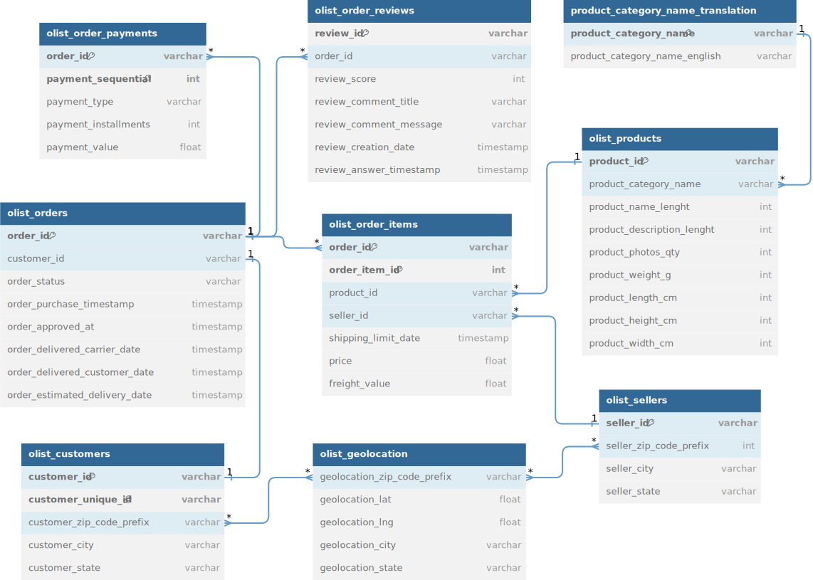

# Olist Brazilian E-Commerce Analysis

  

This project is an analysis of the Olist Brazilian E-Commerce Dataset, which contains information about 100k orders from 2016 to 2018 made at multiple marketplaces in Brazil.

## Requirements
The analysis was made using **Python 3.12.3** and the following libraries:
- duckdb        0.10.1
- keras         3.2.0
- numpy         1.26.4
- pandas        2.2.1
- pendulum      3.0.0
- plotly        5.20.0
- safetensors   0.4.2
- spacy         3.7.4

## Data
The original datasets can be found on [Kaggle](https://www.kaggle.com/olistbr/brazilian-ecommerce) and their data schema is shown below:

  

## Exploratory Data Analysis (EDA)
All analyzes are in the file "01-orders-eda.ipynb".

The topics covered were:
- volume of purchases and payments by state and purchase status
- average ticket per purchase in each region
- what are the regions of origin and destination of the purchased goods
- density map of registered sellers and customers
- number of products purchased from the main categories over time
- some customer metrics, such as:
  - recency
  - churn rate
  - frequency
  - total revenue
- sentiment analysis of comments texts written by customers